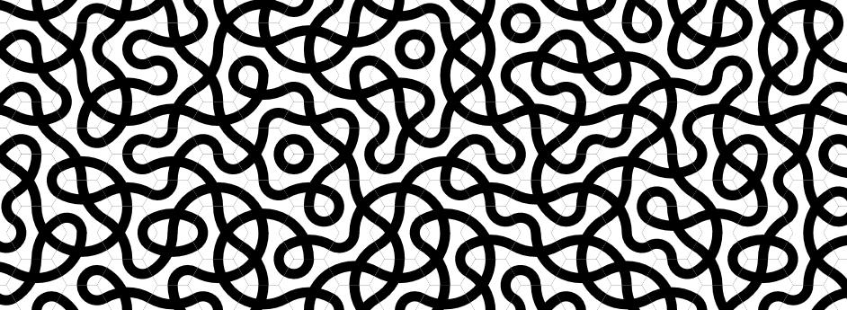

# [hextiles](https://phlaster.github.io/hextiles/)

An infinite, interactive hexagonal tile canvas for exploring peculiar pattens emerging from simple rule.

## Features

- **Infinite Canvas**: Pan and zoom infinitely across a procedurally generated hexagonal grid.
- **Per-Tile Rotation**: Click any tile to rotate it by 60° with a smooth full-circle animation. Double-click to reset it to the default orientation.
- **Custom Textures**: Upload your own image to replace the default pattern. A built-in alignment editor allows you to rotate, scale, stretch, and offset the image to perfectly fit the hexagonal shape before applying.
- **Grid Toggle**: Hide the grid lines to view the pure, seamless tessellation.
- **Bulk Actions**: Randomize all tile angles or reset them all to the default orientation with smooth bulk animations.

## Controls

| Action                       | Effect                                  |
| :--------------------------- | :-------------------------------------- |
| **Scroll Wheel**       | Zoom in / out towards cursor            |
| **Click + Drag**       | Pan the canvas                          |
| **Left Click**         | Rotate tile by 60°                     |
| **`+` / `-` Keys** | Zoom in / out from center               |

> Built with assistance of [GLM 5.1](https://z.ai)
