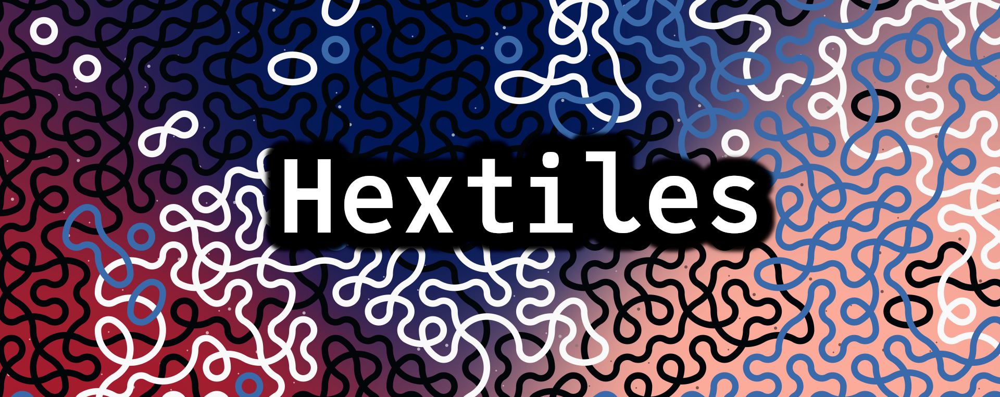

<div align="center">
  
<a href="https://phlaster.github.io/hextiles/" target="_blank">
  
</a>

An infinite hexagonal tiling sandbox.

[](https://vitejs.dev/)
[](https://developer.mozilla.org/en-US/docs/Web/API/WebGL_API)
[](https://developer.mozilla.org/en-US/docs/Web/JavaScript)

</div>

## Controls

| Action | Desktop | Touch |
| :--- | :--- | :--- |
| **Rotate Tile** | `Left Click` | `Tap` |
| **Continuous Rotate** | `Long Left Click, then draw` | `Long Press, then draw` |
| **Pan / Drag** | `Left Click + Drag` | `Swipe` |
| **Zoom** | `Scroll Wheel` / `+` / `-` | `Two-Finger Pinch` |
| **Move Gradient Marker**| `Drag Marker` | `Long press, then drag marker` |
| **Delete Marker** | `Double Click Marker` | `Double Tap Marker` |

## Getting Started

To run Hextiles locally or contribute to its development:

1. **Clone the repository**
   ```bash
   git clone https://github.com/phlaster/hextiles.git
   cd hextiles
   ```
2. **Install dependencies**
   ```bash
   npm install
   ```
3. **Start the development server**
   ```bash
   npm run dev
   ```
   The app will be available at `http://127.0.0.1:5173`.

4. **Build for production**
   ```bash
   npm run build
   ```

## Tech Stack

- **Build Tool**: Vite
- **Rendering**: WebGL2 (Gradient Engine), Canvas2D (Hex/Curve Engine)
- **Math/Logic**: Custom Hex Grid Math, BFS Curve Tracing
- **Exporting**: `jsPDF`, `svg2pdf.js`

## License

This project is licensed under the Apache 2.0 [LICENSE](LICENSE).

<div align="center">
  <sub>Built with passion by <a href="https://github.com/phlaster">phlaster</a>.</sub>
</div>